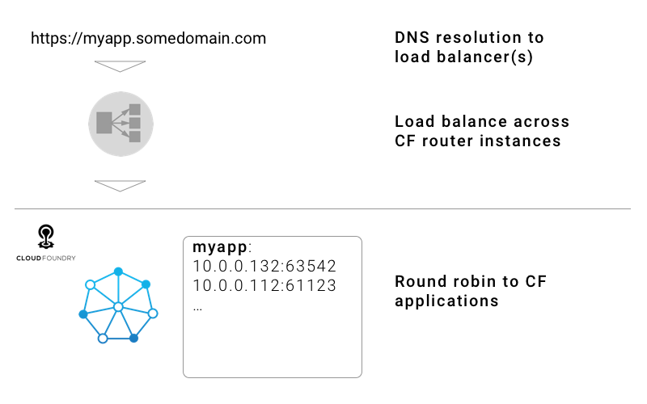

# Networking

Cloud Foundry’s software-defined networking model provides developers with flexible capabilities to securely and efficiently route traffic to and from applications without unnecessary complexity. In this chapter, we cover the platform capabilities for managing routes and domains as well as controlling egress from applications.

## Apps and routes

In Cloud Foundry, a route maps HTTP(S) traffic to one or more applications. Apps and routes have a many-to-many relationship. This means an app may have zero routes or many routes. Similarly, the same route may be mapped to many applications. A route consists of a hostname and a domain in the form of <hostname>.<domain>. For example, you might have a route for a billing application of `billing.cloudfoundry.org` where the hostname is `billing` and the domain is `cloudfoundry.org`.

The commands to manage routes are comprehensive and straightforward. There is no need for developers to manipulate DNS or load balancers as Cloud Foundry routers maintain route tables with up-to-date information. Developers can create routes with `cf create-route` and associate them to an application using `cf map-route`. Routes can also be removed from an application using `cf unmap-route` or deleted using `cf delete-route`.  Routes and route mappings can also be specified in an application manifest.

Route manipulation can be used for A/B testing, route-based branding, or complex application updates where the rolling strategy will not suffice. 

### External domains

External domains are routable from outside of Cloud Foundry. Operators manage the DNS mappings for these domains. A Cloud Foundry instance can have many external domains available for use. However, all Cloud Foundry instances have a default application domain that will be used if no other domain is specified. The default app domain used in the Katacoda scenario is an example of such a domain. Apps accessible from outside of Cloud Foundry are assigned to routes using one or more external domains.

It is trivially easy to add custom domains to a Cloud Foundry instance. Domains are made available at the org level. While the process of adding a domain to Cloud Foundry is easy, it does require the configuration of certificates for that domain. Most Cloud Foundry providers have incorporated custom certificate management services in the marketplace to streamline this process.

### Internal domains

It may be desirable to have some applications be inaccessible from outside of a Cloud Foundry instance for security purposes. Internal domains are only routable from inside a Cloud Foundry instance.
A common example is a RESTful data service that should not be routable from the internet but only available to front-end applications routable from the internet. 

Cloud Foundry instances have a default internal domain of `apps.internal`. You can create routes on this domain and map them to your applications using the same `cf create-route` and `cf map-route` commands. For security, an overlay network controls traffic on this internal network. Traffic must be explicitly allowed to flow from one application to another. This is achieved using the `cf create-network-policy` command. 

> Internal domains are also useful when coupled with a proxy application such as [NGINX](https://nginx.org/). NGINX can be used to control access to applications using a variety of mechanisms like IP, header filtering, or authentication. It can also be used to transform or shape requests. This can be quite useful when adding these features to applications without changing application code. The proxied application can be deployed on an internal network with an NGINX proxy application deployed using an external route. The [cloud.gov](https://cloud.gov) team maintains a repository with such an [example](https://github.com/cloud-gov/tech-talk-internal-routes).

The use of internal domains significantly increases the security for applications that use them. They can help protect sensitive applications and obfuscate the overall architecture of multi-application deployments. This substantially reduces the attack vectors of your application portfolio.

## Application egress access control

Cloud Foundry provides a mechanism to control egress access from applications (where applications can connect out to). This feature is referred to as application security groups. 

System-wide application security groups exist for the staging phase of the application lifecycle and separately for the running phase of an application's lifecycle. These groups are controlled by platform operators with input from security teams. The staging security groups control where buildpacks can fetch resources from when creating the container image for your application. The running security groups control where running applications can connect out to. It is common for running security groups to allow access to the services available in the marketplace.

Security groups can also be applied at the space level by platform operators.

Application security groups are allow-based, meaning by default, no access is allowed, and the allow statements of multiple groups are additive. This enables operators to set restrictive system-wide security groups containing only the platform-wide defaults and allow more permissive exceptions on a space by space level. This ensures egress control follows the principle of least privilege, restricting by default and allowing by exception. This significantly improves the security posture of teams using Cloud Foundry and can help prevent potentially catastrophic leak events from occurring.
