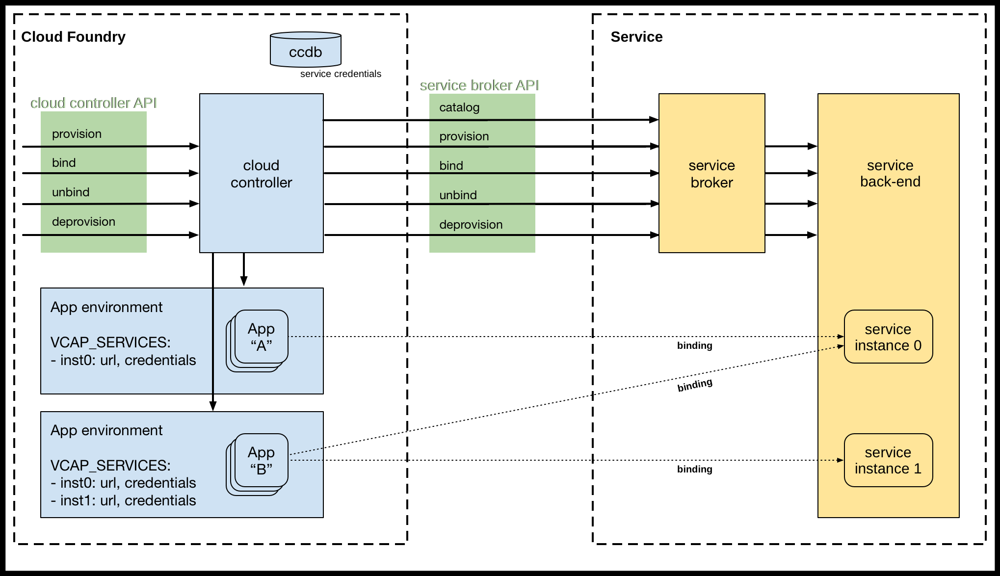
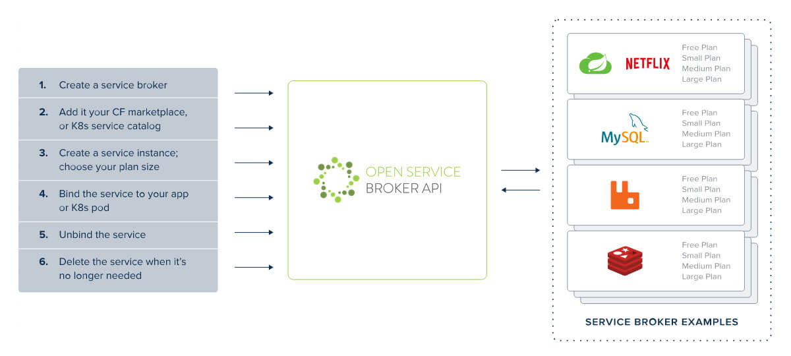

# Services

Most applications will need backing services like a database, message queue, and/or identity service. Cloud Foundry makes it easy for a developer to access the services they need or integrate existing services, like an existing database, with apps in the platform.

## Managed Services

Managed services allow Cloud Foundry users to provision instances of databases, message queues, logging services, and others on-demand, using standard Cloud Foundry commands. Additionally, users can manage service credentials for applications and inject them via the environment. No ticketing systems are needed as operators can manage the service offerings (what users can create on-demand) available in each organization. Additionally, quotas provide additional guardrails to allow developer teams to operate unimpeded but safely.

### The Marketplace

The 'marketplace' lists available services and is where developers can see services they can provision on-demand. You saw this in the Katacoda tutorial when you ran `cf marketplace` or `cf m`. The marketplace is established by Cloud Foundry operators and, therefore will vary depending on what instance of Cloud Foundry you are using. For example, in the Katacoda tutorial, the Cloud Foundry instance only contained a single service offering.

In the marketplace, developers will see the list of services available broken down into tiered offerings called plans. A plan is a specific offering that can be instantiated. Plans enable different configurations or levels of service to be offered. For example, a database service may contain a plan that creates a single database instance in a shared cluster, a plan to provide a dedicated database instance, and a plan to provide a highly available database cluster. Operators can configure chargeback models for these plans.

Cloud Foundry operators control what plans are available in each organization. Therefore, the marketplace can vary depending on the organization and space you are targeted to. 

### Provisioning and Deprovisioning

Creating (provisioning) a new service instance is simple and easy using the `cf create-service` command. Developers simply need to select the plan they want to create and provide any required configuration parameters. They do not need to know how to install, provision, or manage the service they are creating. From the most simple services to the most complex, developers only need to know `cf create-service`.

Of course, deprovisioning or deleting a service instance is also simple, as you saw in the Katacoda tutorial. This is achieved with the `cf delete-service` command.

### Service Credentials

Generating unique credentials and providing them to your application is equally as simple. This is achieved with the `cf bind-service` command. Revoking and destroying application credentials is as simple as `cf unbind-service`. Again, developers do not need to know how to generate credentials and manage them according to the compliance requirements of the group. 

Applications are provided credentials through environment variables. This is an implementation of another 12-factor app best practice: [III. Config](https://12factor.net/config) "Store config in the environment". This best practice ensures the application is decoupled from the service configuration. Let's look at an example of why this is important.

Assume we have an application that uses a database. Suppose we have a development space and separate production space. In that case, we can have a service instance in each (a dev database in the development space and a production database in the production space). These service instances can have the same name since they will be scoped to their respective spaces. The same binding can be represented in the manifest and used to deploy to both spaces. In this way, Cloud Foundry has eliminated the possibility of a misconfigured database credential causing a production issue.

Should a developer need to connect to a service instance, say to inspect a database, Cloud Foundry allows them to provision a unique set of credentials solely for this purpose. This is achieved using `cf create-service-key`. This is an important capability to leverage to ensure a clear audit trail that differentiates actions by an application from those by a developer.

### The Open Service Broker API

Managed services integrate with Cloud Foundry through an API called the [Open Service Broker API](https://www.openservicebrokerapi.org/) (OSBAPI). The OSBAPI is an industry-standard API supported by many cloud platforms and Kubernetes. Provisioning, deprovisioning, and credential management are implemented in a service broker. Each broker advertises a catalog of one or more services, each with a tiered offering called a 'plan'. Platform operators control the available services and plans for each organization.

By standardizing on the OSBAPI, Cloud Foundry can make available any service offering with a broker. Developers only need to know a few simple commands:

- `cf marketplace`: View the marketplace to discover available services.
- `cf create-service`: Provision a new service instance (deprovisioned with `cf delete-service`).
- `cf bind-service`: Generate unique credentials for your application (revoked with `cf unbind-service`).

The OSBAPI is an industry-standard API supported by many platforms and cloud providers, including Kubernetes.

## User-Provided Services

Cloud Foundry also makes it easy to work with existing services provisioned outside the marketplace. These services are referred to as 'user-provided service instances' (upsi). User-provided services are effectively a set of key-value pairs representing credentials for the existing service. They are created with `cf create-user-provided-service`. The same bind and unbind commands are used to tell applications about them through environment variables.

## Impact

Developers can quickly get access to the services they need. Ticketing systems or detailed knowledge on how to deploy and configure services like databases are not required. All services, self-provisioned or user-provided, can be used consistently.

Manual credential management is also a thing of the past. For example, in a dev space, the app is bound to a dev database. In production, the production app instances are bound to a production database. Therefore, there is no need to manage sensitive config files.

Managed services create a self-service system with guard rails. Granular control over plan availability coupled with quotas creates a safe environment where developers can work unimpeded without worry.

By standardizing on the OSBAPI, services become easily auditable and verifiable. In addition, provisioning and credential management functions are encapsulated in code and, therefore, can be tested accordingly. The wild-west of services is over.
