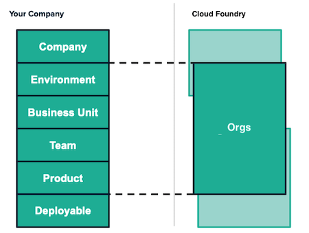
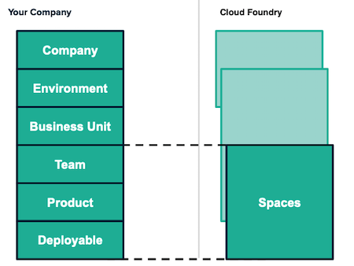
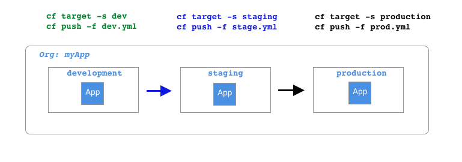

# Team Constructs

Cloud Foundry is a multi-tenant platform designed to support multiple teams or customers by separating tenants and workloads. In this section, we take a quick look at the constructs that make this possible.

## Organizations and Spaces

Organizations (orgs) and spaces are logical separations within a Cloud Foundry instance. Spaces live within orgs, and a single org can contain one or more spaces. Applications, routes, and services are all scoped to a space by default.

Typically orgs separate tenants or projects. So, for example, an org could exist for each project or each tenant. Each org might have separate spaces for different lifecycle stages, like development, staging, and production. Workloads (applications) are always deployed to a space.

Selecting an org and space to work with is called "targeting" and is done with the `cf target` command. In the Killercoda tutorial, the user provisioned for you only had access to one org and space. Therefore, the target org and space were automatically set.

### Environment Parity

The [tenth factor](https://12factor.net/dev-prod-parity) of 12-factor app best practices addresses the need for parity between lifecycle stages: "Keep development, staging, and production as similar as possible." Because spaces are logical separations, they share the exact same underlying infrastructure and configuration mechanisms. Parity between a dev and production space is therefore inherent in the platform. This dramatically reduces the likelihood of an issue caused by a difference in the execution environment.

### Isolation Segments

As stated above, organizations and spaces are logical separations. This means that workloads share the underlying infrastructure with appropriate software-defined partitions (including containers, networks, etc.). An optional feature called [isolation segments](https://docs.cloudfoundry.org/adminguide/isolation-segments.html) can be used to create a separation in the underlying virtual machines assigned to an organization (when using Cloud Foundry deployed on virtual machines). However, this optional feature is not available in deployments on Kubernetes.

## Role-Based Access Control

Cloud Foundry leverages Role-Based Access Control (RBAC) to restrict user actions within the platform. Users can be assigned roles globally (Cloud Foundry-wide) or assigned roles in specific orgs and spaces. In addition, operators can grant management roles at the organization level, freeing them from managing the day-to-day minutia of development teams. Developers are therefore free to manage resources in a self-service fashion, without the need for ticketing systems. And because the below roles are well defined, security and compliance teams can adopt a position of [least privilege](https://en.wikipedia.org/wiki/Principle_of_least_privilege) with confidence they will not be impeding progress.

### Global Roles

Users can be assigned global roles and capabilities that span an entire Cloud Foundry deployment. 

* **Admin**: Operational actions on all orgs and spaces.
* **Admin Read-Only**: Visibility of all orgs and spaces without the ability to modify resources.
* **Global Auditor**: Similar to the `Admin Read-Only` role, except that this role cannot see secrets such as environment variable content.

### Org Roles

Org roles grant users access at the org level.

* **OrgManager**: Administer the org and spaces in that org.
* **OrgAuditor**: Read-only access to the org.
* **BillingManager**: Manage billing account and payment information associated with an org in Cloud Foundry instances that have deployed the billing engine.
* **Org User**: Read-only access to the list of other org users and their roles. 

### Space Roles

Space roles grant user access at the space level.

* **SpaceManager**: Administer users and roles in the space.
* **SpaceDeveloper**: Manage apps, services, and routes in a space. A user must have the `SpaceDeveloper` role to deploy apps.
* **SpaceAuditor**: Read-only access to the space.
* **Space Supporter**: Troubleshoot and debug apps and service bindings in a space.

Org roles do not cascade into spaces. Therefore, an `OrgManager` *cannot* deploy apps to spaces in their org. However, they can grant the `SpaceDeveloper` role to a user (including themselves) for a particular space.

## Quotas

Quotas are named sets of memory, service, and instance usage limits. Quotas are essential guardrails that allow teams to safely operate in a self-service, unimpeded fashion. Quotas apply to orgs and spaces. Org quotas are mandatory, while space quotas are optional. Org-level quotas are shared across all spaces in that org.

Typically, Cloud Foundry operators will establish quotas for orgs, and OrgManagers will set quotas for spaces. After all, resource planning is a collaborative effort.

## Constructs as Code

Compliance requirements often dictate regular audits of environments. The above constructs are easily managed using [Terraform](https://www.terraform.io/) and the [Cloud Foundry Terraform Provider](https://registry.terraform.io/providers/cloudfoundry-community/cloudfoundry/latest), enabling automated auditing and enforcement across all organizations. Using Terraform is not a requirement. However, we mention it here as it provides a declarative way to define and enforce the above constructs in a Cloud Foundry instance.

Terraform is a product of [Hashicorp](https://www.hashicorp.com/) and is not related to the Cloud Foundry Foundation or project.

## Impact

The constructs in this chapter lay the foundation for a secure, multi-tenant platform that enables users to be self-sufficient. Security, compliance, and operations teams work together to define the guard rails in the platform while freeing developers to work unimpeded within those confines. This enables technology organizations to operate efficiently, securely, and with unparalleled speed.
