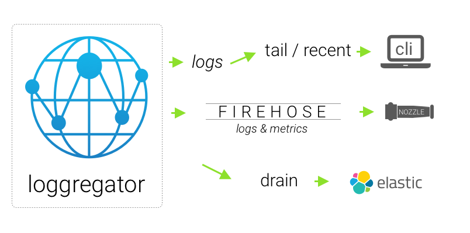

# Visibility

Developers need to understand what is happening with their applications. Similarly, operators need to understand what is happening in the platform. Cloud Foundry provides visibility into the lifecycle of applications and the platform. This visibility is quite helpful for development, troubleshooting, security, and auditing. 

## Application Logs

Cloud Foundry aggregates logs from all app instances into a single stream with no specialized logging libraries required. Developers simply direct logs to standard output and standard error. This does not mean they should abandon log libraries like Log4J, but rather add configuration to ensure logs are sent to standard output and standard error streams.

The log stream for an application includes logs from all application instances and the Cloud Foundry components involved with the execution of the app. Log streams will contain container consumption metrics emitted by the container execution runtime and HTTP access logs emitted by the Cloud Foundry routers. Again, no additional work is required to aggregate this information. 

Cloud Foundry provides the ability to stream logs in near real-time using `cf logs`. This is similar to tailing logs in a UNIX system. Or you can view the most recent logs using `cf logs --recent`. For long-term storage, logs can be drained to a 3rd party logging services like the Elastic Stack, Splunk, and Papertrail via a special type of user provided service instance (see `cf cups --help`).

Cloud Foundry operators can also stream all application and platform logs to 3rd party logging services. Often platform operators will make a logging service available to developers with logs filtered by org and space role of each developer. They will also establish a platform logging service available to operators containing all platform logs. These services can be shared with security and compliance teams as needed. 

## Events

There are two main types of Cloud Foundry events: audit events and usage events. Audit events depict actions taken against resources, such as app starts, stops, scaling, route mapping, and many more. Developers can view audit events for their applications using `cf events`.

Usage events represent the consumption of platform resources and are used by operators (or billing applications) to track the consumption of resources and services. Usage events can be used for a chargeback to different tenants or business units if desired.

## Container Metrics

Metrics for Cloud Foundry application containers can be viewed in the log stream or extracted via CLI plugins. For example, the [top plugin](https://plugins.cloudfoundry.org/#top) is a handy tool to view application metrics in near real-time in a terminal window. Additionally, the [Stratos](https://github.com/cloudfoundry/stratos) user interface graphs container metrics for applications over time. Stratos is an optional component and may not be deployed in your Cloud Foundry instance. When not in use, most Cloud Foundry providers have their own similar user interface.

## Impact

Secure visibility is a complex problem in large-scale cloud platforms. Logs, metrics, and events are powerful resources in identifying patterns and potential incidents but can also be a source of compromised information if not implemented and managed correctly. Cloud Foundry solves the most challenging parts of this problem for all types of users.

Cloud Foundry provides developers, operators, and security and compliance teams with access to the information they need based on their roles in the system. Therefore users get the information they need but nothing more. Additionally, integration with 3rd party log aggregations services is reliable, straightforward, and secure. 

In Cloud Foundry, it is simple for developers to get access to their application logs regardless of the number of application instances in operation. No special libraries or code changes are needed (beyond using standard out and standard error). Developers get the information they need, but only the information they need. 

