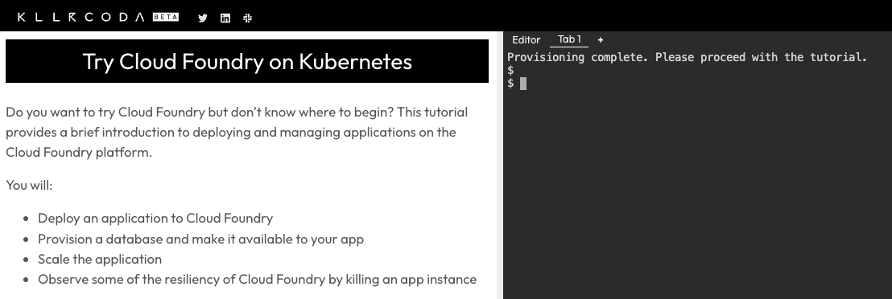

# Try Cloud Foundry

One of the easiest ways to understand the value of Cloud Foundry is to see it in action. This immersive, browser-based scenario does not require any software installs, coding, or special skills. Anyone can do it!

In the tutorial, you will use the Cloud Foundry command line interace (CLI) to:

- Deploy an application to Cloud Foundry running on Kubernetes
- Provision a database and make it available to your app using unique credentials
- Scale the application horizontally by adding instances
- Observe one of the resiliency features of Cloud Foundry by killing an app instance

The CLI is used to interact with Cloud Foundry instances. We will reference CLI commands throughout this course as examples on how to complete specific tasks. However, we will not be covering the CLI specifically in this course as this is covered in the Cloud Foundry for Developers course and this course focuses on the "why" of Cloud Foundry.

The tutorial is hosted on the Killercoda platform and integrated with a live Cloud Foundry instance. Killercoda is an independent learning platform and is not associated with the Cloud Foundry Foundation.

Head over to Killercoda for a brief introduction to deploying and managing applications on the Cloud Foundry platform:

- [Try Cloud Foundry on Killercoda](https://killercoda.com/cloudfoundry/scenario/trycf)

When you are done, head back here to continue. We will discuss the impact of your experience throughout the rest of the course.